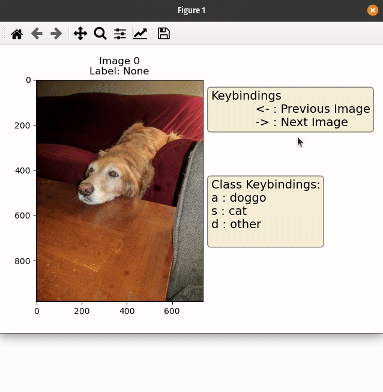
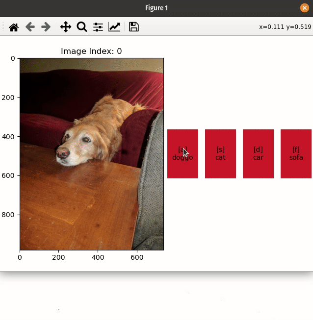

# mpl-image-labeller's Documentation

Use Matplotlib to label images for classification. Works anywhere Matplotlib does - from the notebook to a standalone gui!


## Key features
- Single or Multiclass interfaces!
    - {doc}`examples/single-class`
    - {doc}`examples/multi-class`
- Supports lists of classes or onehot encodings
- Uses keys instead of mouse
- Only depends on Matplotlib
    - Works anywhere - from inside Jupyter to any supported GUI framework
- Displays images with correct aspect ratio
- Easily configurable keymap
- Smart interactions with default Matplotlib keymap
- Callback System (see {doc}`examples/callbacks`)
- Allows Lazy Loading of Images ({doc}`examples/lazy-loading`)

## Install
```bash
pip install mpl-image-labeller
```

## Example GIFs
```{table}
:align: center

| Single Class Interface | Multiclass Interface |
| ----------------------- | --------------------|
| | |
```

## Getting help
Please ask usage questions on the [Matplotlib 3rd Party Package Discourse](https://discourse.matplotlib.org/c/3rdparty/18). When you do so feel free
to use `@ianhi` to ping me.

## Reporting Issues
Please report any issues on github at https://github.com/ianhi/mpl-image-labeller/issues/new/choose


```{toctree}
:maxdepth: 2

API <api/mpl_image_labeller>
contributing
```

```{toctree}
:caption: Examples
:maxdepth: 1

examples/single-class.ipynb
examples/multi-class.ipynb
examples/lazy-loading.ipynb
examples/callbacks.ipynb
```
